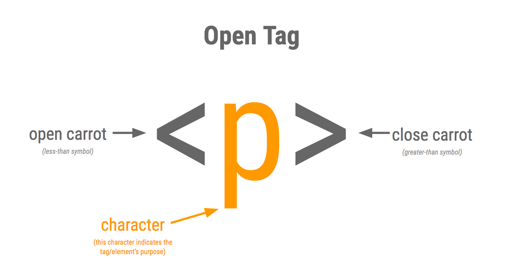
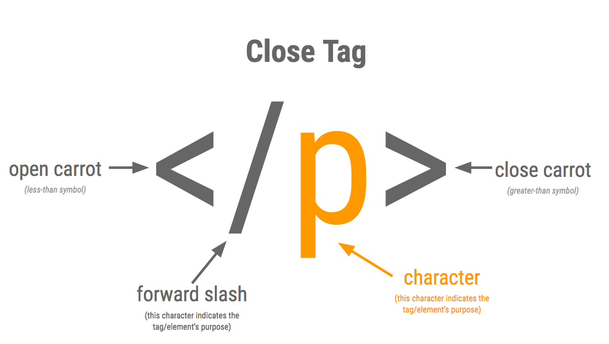
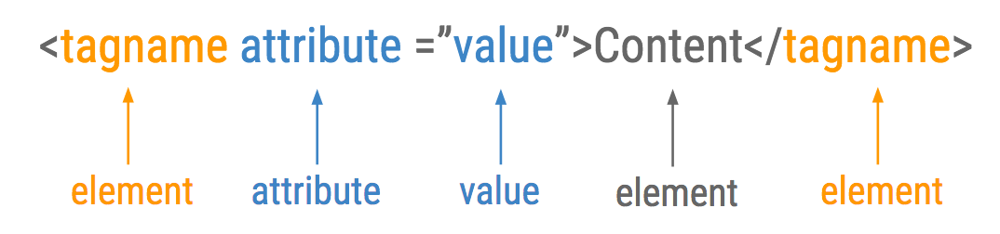

## Day 1
## Introduction & Workspace Set-Up


### Augmented Reality vs Virtual Reality
* **Virtual reality**, or VR, requires you to inhabit an entirely virtual environment.
* **Augmented reality**, or AR, uses your existing natural environment and simply overlays virtual information on top of it. 
* Users of **AR** experience a new and improved natural world where virtual information is used as a tool to provide assistance in everyday activities.

### WEB BASICS REVIEW
* A website consists of three differant parts:
    * Content/Structure/Skeleton (HTML)
    * Style/Skin (CSS)
    * Function/Action (JavaScript)
* HTML 
    * Stands for HyperText Markup Language
    * The structure that holds everything together
    * No HTML... No webpage
    * All computer systems understand the instructions in HTML the same way, and its free!
    * To ensure the browser knows to use the latest version of HTML always include a doctype declaration in the first line of code, like this:

```html
<!DOCTYPE HTML>
```

### HTML TAGS/ELEMENTS
* HTML tags or elements add structure the content.
* Almost all tags/elements have an open and a close tag...







```html
<!DOCTYPE html>
<html>
    <head>
        <meta charset = “UTF-8”>
        <title>This is the Main Heading</h1>
    </head>
    <body>
        <h1>This is the Main Heading</h1>
        <p>This text might be an introduction to the rest of the page. And if the page 
           is a long one it might be split up into several sub-headings.</p> 
        <h2>This is a Sub-Heading</h2>
        <p>Many long articles have sub-headings to help you follow the structure of what 
           is being written. There may even be sub-sub-headings (or lower-level headings).</p> 
        <h2>Another Sub-Heading</h2>
        <p>Here you can see another sub-heading.</p> 
    </body>
</html> 
```

* The **html** tag indicates that anything between the opening tag **<html>**and the close tag **</html>** will be written in HTML code. **It surrounds the whole page, encapsulating all the code within the page!**
* The code contained between the opening tag **<head>**and the close tag **</head>** is meta information. It is usually important information that the rest of the page will need to know, as well as information the browser will need before it renders. **Think of it like a brain!**
* **Meta** tags are tags that don’t encapsulate or contain anything (**void**). They hold information that will not be displayed on the web page, but is important to it. It is often used to set the attributes of the page description, keywords, author of the document, last modified, and other metadata. 
* The **title** tag indicates that anything between the opening tag **<title>**and the close tag **</title>** will be used as the title of the browser window. 
* The code contained between the opening tag **<body>** and the close tag **</body>** is all the actual content of the page. It will be shown in the main browser **It is the belly!** That's where we put all other tags, like headings, paragraphs, divisions (or containers), etc.

### HTML BEST PRACTICES
* **REMEMBER** to make your code legible:
    * Use quotes around attributes
    * Indent to represent nesting
    * Use same capitalization


