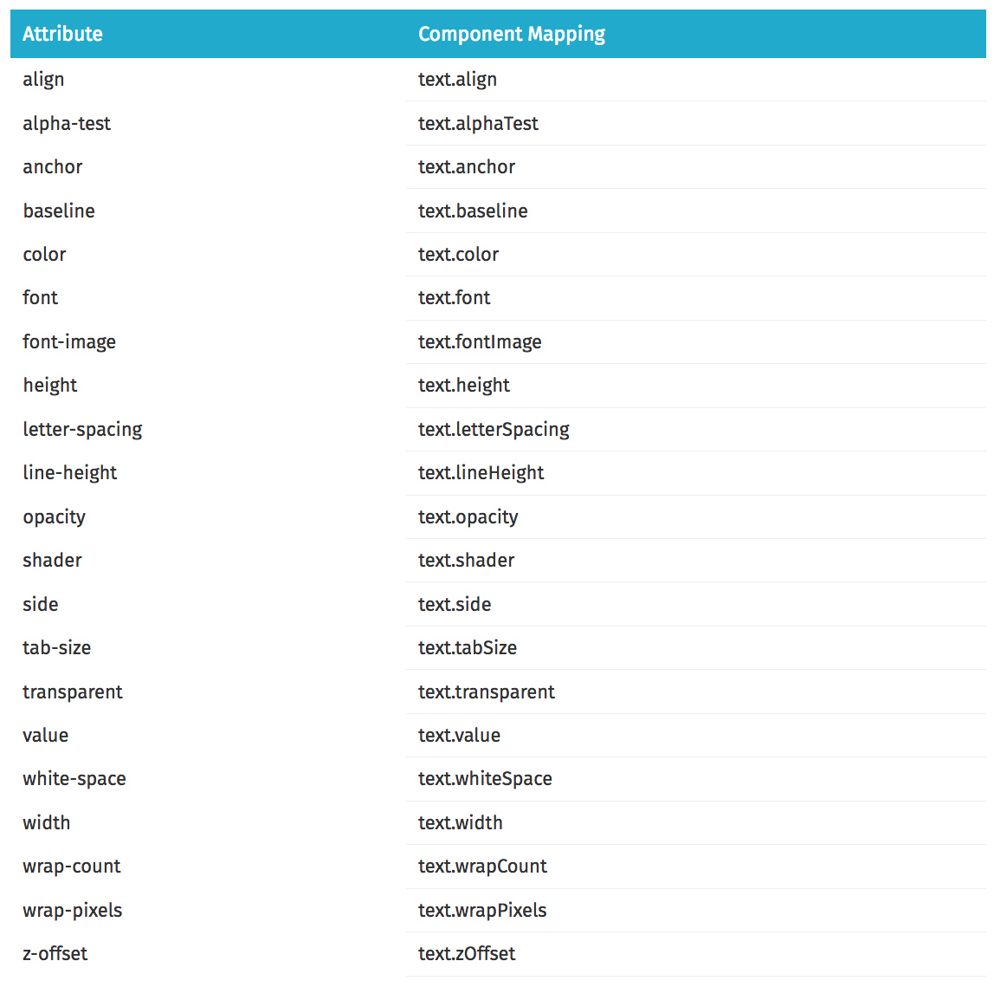
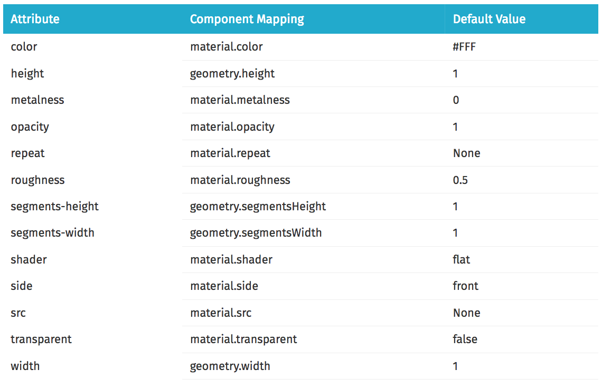

## Day 3
## A-FRAME & AR.js

 

### WHAT IS JAVASCRIPT
* A cross-platform, object-oriented scripting language.
* Used to make webpages interactive, such as parallax scrolling (client side programming)
* Used to build server-side applications, such as rest API's (server side programming)
* To create AR we need to utilize 4 JavaScript Libraries 
    * [**three.js**] to create and display animated 3D computer graphics in the web browser.(https://threejs.org/)
    * **WebGL** for rendering interactive 2D and 3D graphics within aweb browser without the use of plug-ins.
    * **A-Frame** for building virtual reality (VR) experiences.
    * ** AR.js** to create add a virtual element

### A-FRAME & AR.js

```html
<!-- include A-Frame obviously -->
<script src="https://aframe.io/releases/0.6.0/aframe.min.js"></script>
<!-- include ar.js for A-Frame -->
<script src="https://jeromeetienne.github.io/AR.js/aframe/build/aframe-ar.js"></scipt>

````

* To include AR.js, you need to include **aframe-ar.js**.

```html
<a-scene embedded arjs>
```

* Then you initialize ar.js in **<a-scene>**. 

```html
<a-marker-camera preset='hiro'></a-marker-camera>
```

* Then you tell **A-Frame** that you want **arjs** to control the **camera**. For that, you just add


### CREATING A 3D Enviornment
* A scene is represented by the **<a-scene>** element. The scene is the global root object, and all entities are contained within the scene.
* The scene inherits from the Entity class so it inherits all of its properties, its methods, the ability to attach components, and the behavior to wait for all of its child nodes (e.g., <a-assets> and <a-entity>) to load before kicking off the render loop.
* **<a-scene>** handles all of the three.js and WebVR boilerplate for us:
    * Set up canvas, renderer, render loop
    * Default camera and lights
    * Set up webvr-polyfill, VREffect
    * Add UI to Enter VR that calls WebVR API


### Using Text

```html
<a-text value="Hello, World!"></a-text>
```

* The **<a-text>** tags wrap the text component.


### Images

```html
<a-image src="another-image.png"></a-image>
```

* The **image primative** shows an image on a flat plane.



### Image Primatives

```html
<html>
  <head>
    <script src="https://aframe.io/releases/0.5.0/aframe.min.js"></script>
  </head>
  <body>
    <a-scene>
      <a-box position="-1 0.5 -3" rotation="0 45 0" color="#4CC3D9"></a-box>
      <a-sphere position="0 1.25 -5" radius="1.25" color="#EF2D5E"></a-sphere>
      <a-cylinder position="1 0.75 -3" radius="0.5" height="1.5" color="#FFC65D"></a-cylinder>
      <a-plane position="0 0 -4" rotation="-90 0 0" width="4" height="4" color="#7BC8A4"></a-plane>
      <a-sky color="#ECECEC"></a-sky>
    </a-scene>
  </body>
</html>
```

* Primitives act as a convenience layer (i.e., syntactic sugar) primarily for newcomers. Keep in mind for now that primitives are <a-entity>s under the hood that:
    * Have a semantic name (e.g., <a-box>)
    * Have a preset bundle of components with default values
    * Map or proxy HTML attributes to component data

